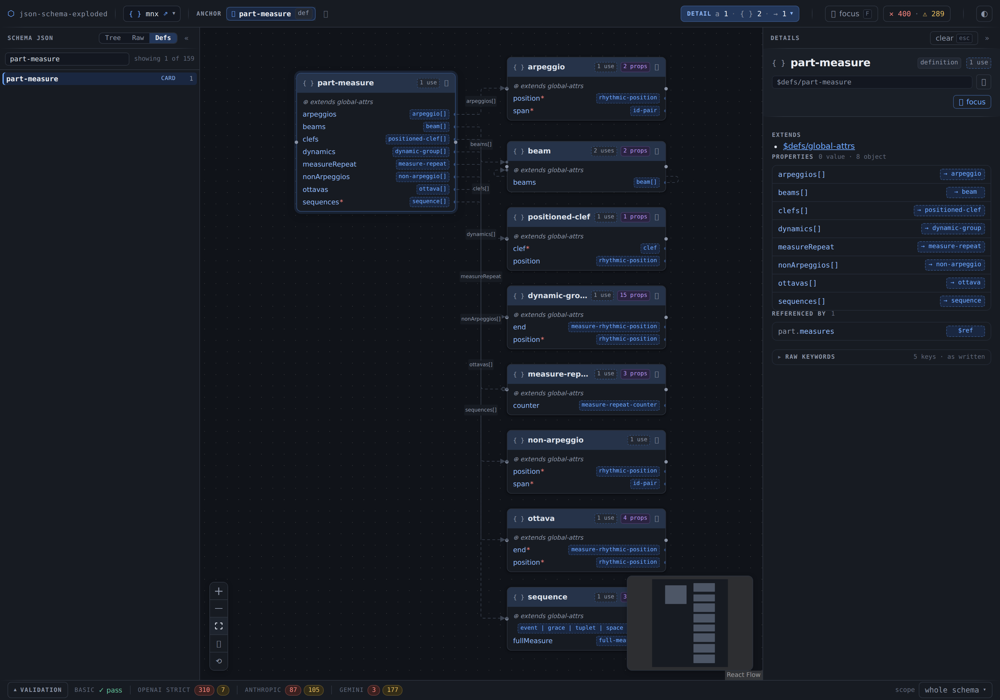

# json-schema-exploded

Read a JSON Schema as a graph instead of a scroll. Definitions become cards, `$ref`s become edges, and how much of it is drawn is a dial rather than an all-or-nothing.

**[Open the demo →](https://owennewo.github.io/json-schema-exploded/)** — loads the [MNX](https://github.com/w3c-cg/mnx) music-notation schema live from its repo.



## What it does

- **Cards and edges.** Objects become cards with their properties as rows; `$ref` becomes an edge, `allOf` becomes an `extends` line, `anyOf` becomes a choice card. Scalars stay rows — they never earn a box of their own.
- **Depth, from wherever you are.** Select a card to anchor the view, then grade three axes independently: how many levels list their value props, their object props, and how many hops of cards are drawn at all. What gets folded away is counted on the card it came from, so nothing goes silently missing.
- **Focus.** One key (`F`) narrows to the anchor's immediate neighbourhood — including what points *at* it, which is the half a containment tree can't show you.
- **Validation.** Live counts against strict-mode profiles (OpenAI, Anthropic, Gemini), per section or over the whole document.
- **Layout that stays put.** Auto-layout by ELK; anything you move by hand wins and is remembered.

## Running it

```sh
npm install
npm run dev            # the port is in the Vite output — it is not always 5173
```

Schemas come from two places:

- **`schemas/`** — local files, listed by a dev-server middleware. Gitignored, so it starts empty; drop any `.json` schema in and it appears in the picker. Card positions and depth settings are written back to `<name>.layout.json` next to it.
- **[`public/remote-schema-urls.json`](public/remote-schema-urls.json)** — a committed `{ "name": "url" }` map, fetched by the browser. Add an entry and the schema shows up under **remote** in the picker, read from the URL every time rather than from a copy that went stale.

```json
{ "mnx": "https://raw.githubusercontent.com/w3c-cg/mnx/main/docs/mnx-schema.json" }
```

A GitHub blob URL works too — it's rewritten to its raw form. The limit is CORS: the host has to send `access-control-allow-origin`, which anything raw-served from a public GitHub repo does.

The deployed build has no backend, so `schemas/` doesn't exist there and the demo runs on remote entries alone.

## Checks

```sh
npm run check:walker       # both fixtures: flat inline objects, and $defs/$ref
npm run check:validation   # the rule library against whatever is in schemas/
npm run build              # tsc --noEmit && vite build
```

`fixtures/` holds what the walker is tested against — a synthetic flat schema for inline nesting and arrays of objects, and a pinned copy of MNX v33 for definitions, references and cycles. Every property either becomes a row or a card, and the check fails if one goes missing.

Built with Vite, React, [React Flow](https://reactflow.dev) and [ELK](https://eclipse.dev/elk/).
